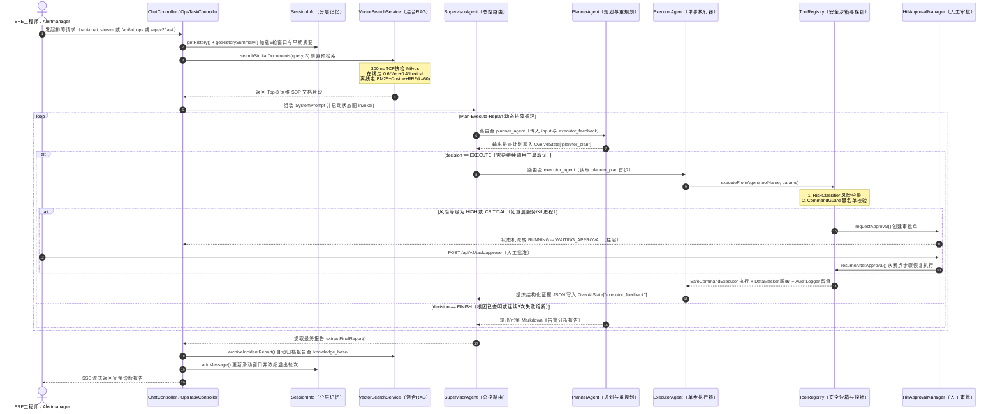
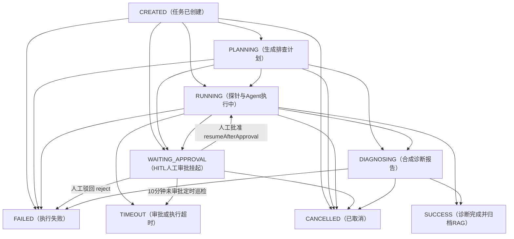

# 运维 Agent 系统（Operations-Agent / OpsPilot 2.0）全链路运行时流程图

> **配套主文档**：[`面试运维agent项目剖析.md`](file:///E:/java/workspace/Operations-Agent/Operations-Agent-main/面试运维agent项目剖析.md)  
> **说明**：本文件包含两套完全对照源码（精确到类名与函数名）的运行时流程图：
> 1. **通用 ASCII 源码级调用时序图**（任何编辑器 100% 原样显示）
> 2. **Typora 100% 兼容的 Mermaid 运行时时序图与状态机流转图**

---

## 一、三大运行链路源码级全景时序图（ASCII 版）

```text
========================================================================================================================
 链路 A：交互式多轮排障问答 (POST /api/chat_stream) —— 单 Agent ReAct + 分层记忆 + 混合 RAG
========================================================================================================================
[用户/浏览器]
   │ 1. POST /api/chat_stream {Id, Question}
   ▼
[ChatController.chatStream() (L159)]
   ├─► 2. getOrCreateSession(Id) ──► [SessionInfo (L477)] (ReentrantLock 线程安全读取)
   │       ├─ getHistory()         ──► 读取最近 6 对滑动窗口问答 (MAX_WINDOW_SIZE = 6)
   │       └─ getHistorySummary()  ──► 读取滑出窗口的早期历史浓缩摘要 (<= 1200 chars)
   │
   ├─► 3. [ChatService.createDashScopeApi() (L85)]
   │       └─ isMultimodalEndpointModel("qwen3.8-flash") == true
   │          ──► 自动切换 completionsPath 至 "/api/v1/services/aigc/multimodal-generation/generation"
   │
   ├─► 4. [ChatService.buildSystemPrompt(history, historySummary, question) (L141)]
   │       ├─ (4.1) Pre-retrieval RAG 预检索:
   │       │        [VectorSearchService.searchSimilarDocuments(question, 3) (L95)]
   │       │          ├─ [MilvusClientFactory.isPortOpen() (L60)] (300ms TCP Socket 存活快检)
   │       │          ├─ 若 Milvus 在线: 召回 Top-9 ──► L2转相似度 1/(1+d) ──► 0.6*Vec + 0.4*Lexical 重排取 Top-3
   │       │          └─ 若 Milvus 离线: [hybridLocalSearch() (L341)] (Okapi BM25 + 64维余弦向量 + RRF k=60 融合)
   │       ├─ (4.2) 注入 [早期对话关键上下文摘要 (historySummary)]
   │       └─ (4.3) 注入 [近期滑动窗口对话历史 (history)]
   │
   ├─► 5. [ChatService.createReactAgent(chatModel, systemPrompt) (L243)]
   │       ├─ .methodTools(buildMethodToolsArray()) ──► 挂载 5 个本地 @Tool Bean (含 HostInspectionTools 9大探针)
   │       └─ .tools(getToolCallbacks())            ──► 挂载外部 MCP 工具 (@tencentcloud/cls-mcp-server)
   │
   └─► 6. [ReactAgent.stream(question) (L220)] ──► 返回 Reactor Flux<NodeOutput>
           │
           ├──► 【ReAct 循环：LLM 决定调用工具 (tool_calls 非空)】
           │       │
           │       ├─► 通道 1 (本地探针): [HostInspectionTools.@Tool]
           │       │     └─► [ToolRegistry.executeFromAgent() (L80)]
           │       │           ├─ [RiskClassifier.classify() (L30)] (LOW / MEDIUM / HIGH / CRITICAL)
           │       │           ├─ [CommandGuard.validate() (L87)]   (13条毁灭性命令正则黑名单拦截)
           │       │           ├─ [SafeCommandExecutor.execute() (L75)] (15s 超时 + 64KB 截断 + 双线程异步读流)
           │       │           ├─ [DataMasker.mask() (L25)]         (脱敏 Password/Token/PrivateKey)
           │       │           └─ [AuditLogger.logAction() (L23)]   (持久化至 AuditLogEntity)
           │       │
           │       └─► 通道 2 (Agentic 二次 RAG / Prometheus / CLS 日志):
           │             └─► [InternalDocsTools.queryInternalDocs()] / [QueryMetricsTools] / [MCP Client]
           │
           ├──► 【异常自愈分支：AgentLlmNode 返回 "Exception:..." 或网络异常】
           │       └─► [ChatService.buildLocalDiagnosticReply(question) (L279)]
           │             (自动执行本地混合 RAG + 宿主机 server_info/cpu/memory 真实探针生成保底报告)
           │
           └──► 【终止条件：LLM 不再返回 tool_calls，输出最终回答】
                   ├─ SseEmitter 逐块推送 OutputType.AGENT_MODEL_STREAMING 增量文本
                   ├─ [SessionInfo.addMessage(question, fullAnswer) (L502)]
                   │    └─ 若窗口 > 12 条消息，弹出最旧一对调用 appendCompressedSummary() 归档至早期摘要
                   └─ 发送 SseMessage.done()，关闭 SSE 连接

========================================================================================================================
 链路 B & C：AI Ops 多 Agent 排障 & 受控任务状态机 + HITL 人工审批 (OpsPilotAgentEngine + AiOpsService)
========================================================================================================================
[触发源：POST /api/ai_ops 或 POST /api/v2/task/create 或 POST /api/v2/webhook/alertmanager]
   │
   ▼
[AlertDeduplicator.isDuplicate(fingerprint) (L23)] (5分钟滑动窗口告警指纹防抖抑制)
   │
   ▼
[OpsPilotAgentEngine.createTask() (L92) & executeTask(taskId) (L119)]
   ├─► 1. [ToolRegistry.bindActiveTask(taskId) (L48)] (InheritableThreadLocal 绑定当前任务上下文)
   ├─► 2. [TaskStateMachine.transition(CREATED -> PLANNING) (L45)]
   │       └─ generateBaselineSteps(rawPrompt) + 檢查是否包含 HIGH/CRITICAL 高危操作步骤
   ├─► 3. [TaskStateMachine.transition(PLANNING -> RUNNING) (L140)]
   │
   ├──► 【分支 1：无前置高危命令且 LLM 可用 ──► 启动多 Agent 状态图 (AiOpsService.executeAiOpsAnalysis L73)】
   │       │
   │       ├─ Pre-retrieval RAG: enrichWithRagKnowledge() 预检索 Top-3 SOP 注入初始任务 Prompt
   │       │
   │       └─ [SupervisorAgent ("ai_ops_supervisor") (L83)] ◄─── 监控 OverAllState 共享状态池
   │             │
   │             ├─► 路由至 [planner_agent (Planner + Replanner)] (L164)
   │             │     ├─ 读取 {input} 与 {executor_feedback}
   │             │     ├─ 若需继续排查: 输出 JSON {decision: "EXECUTE", step: "..."} 写入槽位 "planner_plan"
   │             │     └─ 若证据已闭环 (或同一工具连续失败3次): 输出 decision=FINISH 与 Markdown《告警分析报告》
   │             │
   │             └─► 路由至 [executor_agent (Single-Step Executor)] (L179)
   │                   ├─ 读取 {planner_plan}，严格只执行首个步骤 (调用 Prometheus/CLS/RAG/HostInspectionTools)
   │                   └─ 在局部消化冗长原始日志，提炼结构化 JSON {status, summary, evidence, nextHint}
   │                      写入槽位 "executor_feedback"（隔离上下文污染！）
   │
   ├──► 【分支 2：执行中途遇到 HIGH / CRITICAL 高危操作 (如 restart / kill)】
   │       │
   │       ├─► [HitlApprovalManager.requestApproval() (L43)]
   │       │     ├─ 生成审批工单 HitlApprovalEntity (默认 10 分钟超时)
   │       │     ├─ [TaskStateMachine.transition(RUNNING -> WAITING_APPROVAL) (L55)]
   │       │     └─ [AuditLogger.logAction("APPROVAL_REQUESTED")]
   │       │
   │       ├─► ⏸️ 任务线程立即挂起返回，等待 SRE 人工介入
   │       │
   │       └─► [SRE 调用 POST /api/v2/task/approve (OpsTaskController.handleApproval L160)]
   │             ├─ 若 REJECT: 状态流转至 FAILED，记录驳回审计
   │             └─ 若 APPROVE:
   │                  ├─ [HitlApprovalManager.approve() (L74)] ──► 状态流转 WAITING_APPROVAL -> RUNNING
   │                  └─ [OpsPilotAgentEngine.resumeAfterApproval() (L222)]
   │                       └─ 遍历 TaskStepEntity，跳过 StepStatus.SUCCESS 步骤，从断点处继续执行高危步骤！
   │
   └─► 4. 收尾与知识自演进：
           ├─ [TaskStateMachine.transition(RUNNING -> DIAGNOSING -> SUCCESS) (L195-L200)]
           ├─ [OpsPilotAgentEngine.synthesizeDiagnosisReport() (L318)] / [AiOpsService.extractFinalReport() (L137)]
           └─ [VectorSearchService.archiveIncidentReport() (L219)]
                └─ 自动生成 knowledge_base/incident_<taskId>.md 并切块加入混合检索索引池
```

---

## 二、Mermaid 交互时序图（100% 兼容 Typora 渲染）

### 2.1 一次完整排障请求的运行时生命周期时序图



---

### 2.2 `TaskStateMachine` 受控任务状态机流转图（对应 [`TaskStateMachine.java`](file:///E:/java/workspace/Operations-Agent/Operations-Agent-main/src/main/java/org/example/engine/TaskStateMachine.java#L19-L29)）


